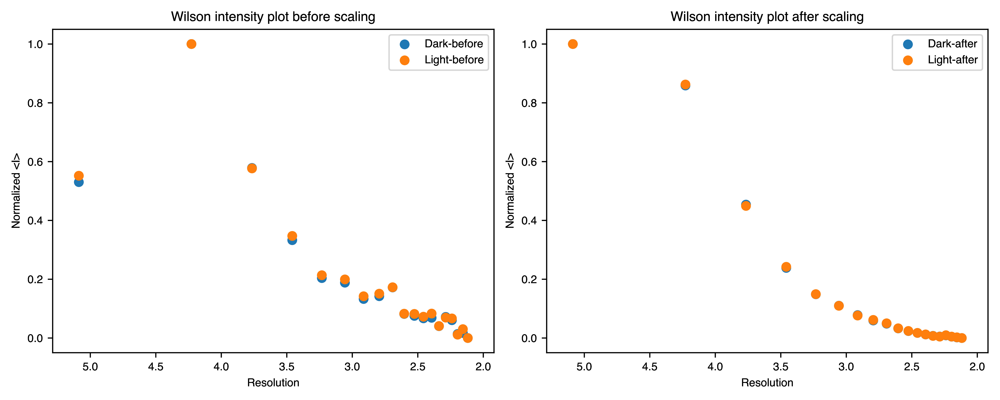
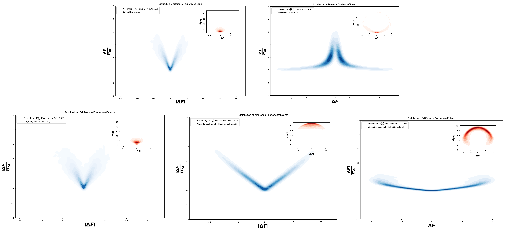
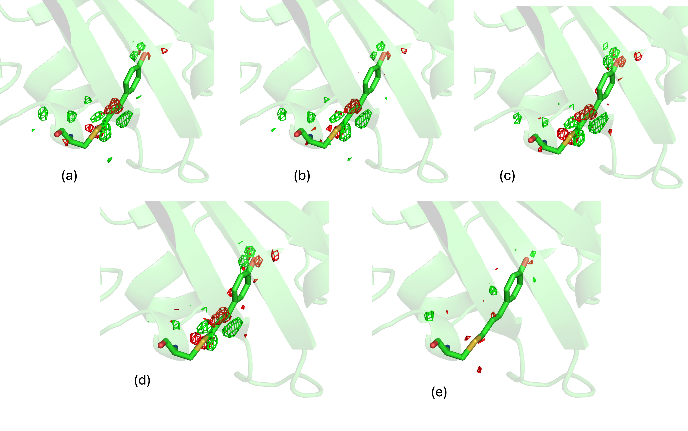

# Quick Start
```{toctree}
    :titleonly:
    :maxdepth: 1
    :caption: "Contents:"
    :hidden:
        self

```
Getting started with `ResiDEM`. 

The main command line utility of the ResiDEM is ``residem``. 
This utility generates isomorphous difference density map and identifies the residues associated with difference density. 
The basic command line argument to run the calculation, generate isomorphous difference density (DED) map  and residue identification is as follows:

~~~bash 
# given the working directory is test_data
residem -r dark/5b6v.pdb -m dark/5b6v.mtz -t 05_760ns/5b6x.mtz
residem -r dark/5b6v.pdb -m dark/5b6v.mtz -t dark/5b6x.mtz --scale aniso/iso/no -w ursby/ren/hekstra/default -sm cctbx/ccp4 
~~~
In the above example, DED map is calculated for 760ns triggered structure (pdb id: 5b6x) with respect to dark state structure (pdb id: 5b6v).


## Inputs 

It requires a reference state pdb `-r`, an reference state `-m` and triggered state `-t` mtz files containing 
structure factor amplitudes or intensities. The reference state,triggered state
mtz should also have a column associated with structure factor amplitudes and its associated sigma "FP,SIGFP" or 
intensities with column name "I,SIGI". 

## Scaling 

Isomorphous difference density map rely on proper scaling of the  reference state observed structure factor {math}`|F_{obs}^{ref}|` 
and triggered state observed structure factor {math}`|F_{obs}^{t}|` .
This is done through resolution dependent scaling which can be either isotropic or anisotropic. 
The tool has a few options to scale the reference and triggered state structure factor. 
This consists of scaling using either cctbx based scaling method or using ccp4 based scaleit method. 
There are three options such as `--scale no` scaling, `--scale iso` isotropic scaling or `--scale aniso` which can be applied for scaling. 
The scaling can be done either using inbuilt method using `-sm cctbx` library or using `-sm ccp4` scaleit.
After scaling, the time dependent intensities and its Wilson Plots corresponding to {math}`|F_{obs}^{t}|^2` and 
the {math}`|F_{obs}^{ref}|^2` should have approximately same slopes.


Figure 1: Wilson plot of 760ns bR Intensities before and after anisotropic scaling. 

## Isomorphism indicators
### Cross -R-Factor ( {math}`R_{iso}`) and  Isomorphism indicating correlation coefficient ({math}`CC_{iso}`).

After scaling, an estimate can be obtained quantitatively to identify how similar the reference state data is 
isomorphous to the triggered state data. The {math}`R_{iso}` is the mean fractional deviation between the observed amplitudes. 


```{math}
R_{iso} = \frac{\Sigma |F_{obs}^{ref} - F_{obs}^{t}|}{\frac{\Sigma |F_{obs}^{ref} + F_{obs}^{t}|}{2}}
```
{math}`R_{iso}` can be obtained by summing overall pairs of common reflections observed in both the data sets. 
{math}`R_{iso}` values below 10% produces a clear difference density while {math}`R_{iso}` up to 25% can still 
provide interpretable difference density[[1](https://doi.org/10.1016/S0076-6879(03)74007-5)]. 

Analogous equation for Isomorphism indicating correlation coefficient {math}`CC_{iso}` is calculated by:
```{math}
CC_{iso} = \frac{\Sigma \left[ (F_{obs}^{ref} -\overline{F_{obs}^{ref}} ) (F_{obs}^{t} - \overline{F_{obs}^{t}})\right]}
{\sqrt{\Sigma(F_{obs}^{ref} -\overline{F_{obs}^{ref}} )^2 * \Sigma (F_{obs}^{t} -\overline{F_{obs}^{t}} )^2}}
```

Higher {math}`CC_{iso}` indicates higher Isomorphic correlation. 


Figure 2:  Plot showing {math}`R_{iso}` and {math}`CC_{iso}`of 760ns bR data. 


## Weights

DED maps can be noisy, and efforts are made to identify the source of the noise which might affect it. 
[Ursby and Bourgeois(1997)](https://doi.org/10.1107/S0108767397004522) introduced weighting scheme to extract the best difference map out of poorly measured data 
and its associated errors in the structural model required to calculate {math}`\phi_{ref}`. Two main errors associated to Difference structure factor (DSF) that are determined from
(i) from large amplitudes as well as (ii) from poorly measured amplitudes with large experimental errors [[2](https://doi.org/10.1063/4.0000196)]. By incorporating Bayesian statistics
to down weigh large difference or those with large experimental errors, [Ursby and Bourgeois(1997)](https://doi.org/10.1107/S0108767397004522) introduced weighting scheme to 
mitigate the noise in DED maps. 

### 1. Urbsy weighting scheme
The weighting scheme implemented by [Ursby and Bourgeois(1997)](https://doi.org/10.1107/S0108767397004522) is given by:

```{math}
ω=\frac{εσ_D^2/2}{σ^2_{(obs,F)} + σ'^2_{(obs,F)} +εσ_D^2/2}

```
Where ω is the weight, ε is the correlation factor for the expected intensity in 
reciprocal lattice zone (multiplicity factor)[[3](https://doi.org/10.1107/s0567739477001272.),[4](https://doi.org/10.1107/s0567739476002064)].
{math}`σ^2_{(obs,F)}` is the variance of {math}`F` in the parent (reference structure) and {math}`σ'^2_{(obs,F)}` is the variance of the related (triggered) structure. 
{math}`σ_D^2` is obtained by {math}`n\overline{(F'-F)^2)}/ε` where {math}`\overline{(F'-F)^2} )` denotes the mean of {math}`(F'-F)^2` and
n=1 for centric reflections and 2 for acentric reflections respectively.
Further, to reduce the overestimation of {math}`σ_D^2`, deconvoluted form may be used[[5](https://doi.org/10.1107/S0108767397004522)]. 
Deconvoluted form is achieved by subtracting {math}`\overline{σ^2_{(obs,F)}+σ'^2_{(obs,F)}}` from {math}`(F'-F)^2`but not 
letting {math}`σ_D^2` less than {math}`n\overline{(F'-F)^2)}/2ε`, 
i.e., The non-deconvoluted and deconvoluted version of {math}`σ_D^2` are:

```{math}
σ_{ND}^2 = n\overline{(F'-F)^2)}/ε
```

```{math}
σ_{D}^2 = n\overline{(F'-F)^2)} - \overline{(σ^2_{(obs,F)}+σ'^2_{(obs,F)})}/ε
```
`if` {math}`σ_{D}^2 \geq σ_{ND}^2/2`
```{math}
ω=\frac{εσ_D^2/2}{σ^2_{(obs,F)} + σ'^2_{(obs,F)} +εσ_D^2/2}
```
`else`
```{math}
    ω=\frac{εσ_{ND}^2/2}{σ^2_{(obs,F)} + σ'^2_{(obs,F)} +εσ_{ND}^2/2}
```

### 2. Ren Weighting scheme 

[Ren et al.](https://doi.org/10.1021/bi0107142) simplified the Ursby weighting scheme and given as follows:

```{math}
ω=\left[1 + \frac{\Delta F^2}{\langle|\Delta F|\rangle^2} + \frac{σ_{\Delta F}^2}{\langle σ_{\Delta F}\rangle^2} \right]^{-1}

```

```{math}
\sigma_{\Delta F} = \sqrt{{\sigma^{\text{obs}}_{\text{ref}}}^2 + {\sigma^{\text{obs}}_{t}}^2}

```

### 3. Modified Ren weight/ Hekstra weighting scheme 
 
[Ren et al.](https://doi.org/10.1021/bi0107142) was further modified by [Schmidt et al.,](https://doi.org/10.1016/S0006-3495(03)75018-8) 
where mean of squares is taken instead of square of mean in denominator term. [Hekstra et al.,](https://doi.org/10.1038/nature2057) also use the modified Ren weight with some modifications in second term. 
The general representation of the modified Ren weight is given by:


```{math}
ω=\left[1 + \frac{\Delta F^2}{\langle|\Delta F|^2\rangle} + \alpha \frac{σ_{\Delta F}^2}{\langle σ_{\Delta F}^2\rangle} \right]^{-1}

```
[Schmidt et al.,](https://doi.org/10.1016/S0006-3495(03)75018-8)  uses {math}`\alpha =1` while [Hekstra et al.,](https://doi.org/10.1038/nature2057) uses {math}`\alpha =0.05`


### 4. General representation of weight 

In general, the weighted isomorphous difference structure factor is given by 
```{math}
\Delta F_{hkl,w} = \frac{ω_{hkl}}{\langle ω \rangle} * \Delta F_{hkl}
```
```{math}
σ_{\Delta F_{hkl,w}} = \frac{ω_{hkl}}{\langle ω \rangle} * σ_{\Delta F_{hkl}}
```

where the term {math}`\frac{ω_{hkl}}{\langle ω \rangle}` may correspond weighting scheme such as `ursby`, `ren` and modified ren (`hekstra`) with {math}`\alpha=0.05/1` as discussed above. 


 [Nango et al.](https://www.science.org/doi/10.1126/science.aah3497) for Bacteriorhodopsin(bR) dataset did not use any weights.
 In order to discuss more about the weights, another test dataset of Photoactive yellow protein (PYP) published by [Pandey et al.,](https://doi.org/10.1038/s41592-019-0628-z) is discussed below. 



Figure 3: Plot showing distribution of amplitude of difference structure factor as a function of signal-to-noise ratio for various weights. 
Clearer PDF file for the image can be found [here](images/Difference_structure_factor_distribution.pdf).

In Figure 3,  we see the distribution of difference Fourier coefficients is plotted against signal-to-noise ratios with and without weight. 
The image gives an overview about the distribution of the difference structure factor and experimental error(sigma) in inset plot. In the first distribution we can see the {math}`|\Delta F|` 
as a function of signal-to-noise  ratio {math}`|\Delta F|/ σ_{| \Delta F|} `, the inset of the plot is the distribution of
{math}`|\Delta F| ` vs  {math}`σ_{| \Delta F|}`. It can be seen that by using modified Ren weight or `hekstra` weight with alpha=1 by [Schmidt et al.,](https://doi.org/10.1016/S0006-3495(03)75018-8)
is the one which has the least errors, which satisfies the condition. This denotes that there are no large amplitudes with large experimental errors (sigma) values, 
and hence is chosen as best weight for PYP. 

The obtained isomorphous difference map (DED) without and with weight is shown in the following figure. 



Figure 4: DED maps of  PYP protein  with 30ps time delay published by [Pandey et al.,](https://doi.org/10.1038/s41592-019-0628-z). (a) DED map without weight 
(b,c,d and e ) weighted DED map with various weighting scheme such as Ursby, 
modified Ren with alpha = 0.05, modified Ren with alpha =1 and weight implemented by Ren respectively. 

The data associated with PYP can be downloaded from the [supplementary data](https://doi.org/10.1038/s41592-019-0628-z) of the [published paper](https://doi.org/10.1038/s41592-019-0628-z) and following command can be used to analyse the data. 

~~~bash 
residem -r dark_HCC_v6.pdb -m FOBS_dark1.mtz -t FOBS_30ps.mtz -rl  "F_DARK,SIGF_DARK" -tl "F_30ps,SIGF_30ps" -fl "FC_DARK,PHIC_DARK"  -w hekstra -ws 0.05
# This will generate Figure 3 in PDF format. 
# in General the -ws term which corresponds to alpha has to be set to be 1. 
residem -r dark_HCC_v6.pdb -m FOBS_dark1.mtz -t FOBS_30ps.mtz -rl  "F_DARK,SIGF_DARK" -tl "F_30ps,SIGF_30ps" -fl "FC_DARK,PHIC_DARK"  -w hekstra -ws 1

~~~

In both the cases, the program could identify the chromosphere (HCC-[69](images/one_dimensional_linear_plot.pdf))  with C2-C3 double bond having the highest difference density contribution. 


### Quick description about the outputs

After running the previous command lines and if you see in `tree` command you might  get the following. 

~~~bash
.
|-- Data_folder_0
|   |-- map_dump_default
|   |   |-- chain_A_U
|   |   |   |-- Atom_peak_height_chain_A_U.pdf
|   |   |   |-- Residual_peak_height.csv
|   |   |   `-- Residual_peak_height_mean_chain_A_U.pdf
|   |   `-- chain_X_U
|   |       |-- Atom_peak_height_chain_X_U.pdf
|   |       |-- Residual_peak_height.csv
|   |       `-- Residual_peak_height_mean_chain_X_U.pdf
|   |-- map_dump_hekstra
|   |   |-- chain_A_U_csv
|   |   |   |-- map_dump_common_both_postv_n_negtv_chain_A_U.csv
|   |   |   |-- map_dump_full_negative_chain_A_U.csv
|   |   |   |-- map_dump_full_positive_chain_A_U.csv
|   |   |   `-- map_dump_full_positive_negative_chain_A_U.csv
|   |   |-- chain_A_U_json
|   |   |   |-- map_dump_common_both_postv_n_negtv_chain_A_U.json
|   |   |   |-- map_dump_full_negative_chain_A_U.json
|   |   |   |-- map_dump_full_positive_chain_A_U.json
|   |   |   `-- map_dump_full_positive_negative_chain_A_U.json
|   |   |-- chain_X_U_csv
|   |   |   |-- map_dump_common_both_postv_n_negtv_chain_X_U.csv
|   |   |   |-- map_dump_full_negative_chain_X_U.csv
|   |   |   |-- map_dump_full_positive_chain_X_U.csv
|   |   |   `-- map_dump_full_positive_negative_chain_X_U.csv
|   |   `-- chain_X_U_json
|   |       |-- map_dump_common_both_postv_n_negtv_chain_X_U.json
|   |       |-- map_dump_full_negative_chain_X_U.json
|   |       |-- map_dump_full_positive_chain_X_U.json
|   |       `-- map_dump_full_positive_negative_chain_X_U.json
|   |-- Difference_map_weighted_all.mtz
|   |-- Difference_structure_factor_distribution.pdf
|   |-- F_obs_minus_F_obs.ccp4
|   |-- F_obs_minus_F_obs_hekstra_weight.ccp4
|   |-- F_obs_minus_F_obs_ren_weight.ccp4
|   |-- F_obs_minus_F_obs_ursby_weight.ccp4
|   |-- R_iso_CC_iso.pdf
|   |-- Residem.log
|   |-- Wilson_plot_comparison.pdf
|   `-- input.phil
|-- FOBS_30ps.mtz
|-- FOBS_dark1.mtz
|-- dark_HCC_v6.pdb
|-- final_tree.md
|-- initial_tree.md
`-- readme.md
~~~
- `input.phil` is a Python Hierarchial Input Language (phil) file containing all the input argument which can be used for reproduction.
- `Difference_map_weighted_all.mtz` mtz file contains difference map without and 
with weight for all the implemented weights and the phase of the reference model.
- `Difference_structure_factor_distribution.pdf` file contains distribution of the Difference structure factor 
with and without weights plotted as a function of signal-to-noise ratio.
- `*.ccp4` The DED maps in CCP4 format for various weights. 
- `R_iso_CC_iso.pdf` file contains a plot representing {math}`R_{iso}` and {math}`CC_{iso}`.
- `Residem.log` is a log file containing all the details. 
- `Wilson_plot_comparison.pdf` contains Wilson plot of normalized intensities before and after scaling. 
Ideally the slope of the intensities  should be similar. 
- `map_dump_default,map_dump_hekstra` folder contains results of difference peak details for individual chains.

A detailed description of the content of the results are discussed in [results](Result.md) and [command line](command.md) sessions.  


<script>
document.querySelectorAll('a[href^="http"]').forEach(link => {
    link.setAttribute('target', '_blank');
});
</script>